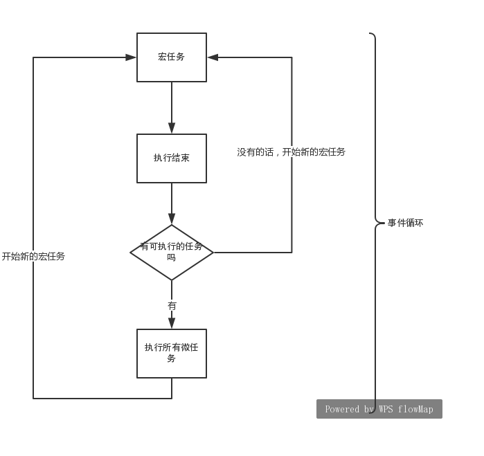

# JS 事件循环

JavaScript是一个单线程的脚本语言。

## 微任务与宏任务的区别

在当前的微任务没有执行完成时，是不会执行下一个宏任务的。

总结：宏任务按任务队列顺序执行，执行完一个宏任务之后询问是否有微任务需要执行，如果有就执行，如果没有就继续开始下一个宏任务的执行。



代码片段：

```js
setTimeout(_ => console.log(4))

new Promise(resolve => {
  resolve()
  console.log(1)
}).then(_ => {
  console.log(3)
})

console.log(2)
```

`setTimeout`是宏任务，`Promise.then`是微任务，上述代码的执行顺序是按照序号输出。

`所有会进入的异步都是指的事件回调中的那部分代码`，所以`new Promise`在实例化的过程中执行的代码都是同步进行的。

宏任务必然是在微任务之后执行的（因为微任务实际上是宏任务的其中一个步骤）

## Promise对象特性

1. Promise属于微任务
2. Promise的构造函数是同步的，而then里的是异步的
3. Promise状态不可逆
4. Then或catch return出去的数值会被后面的then或者catch接受
5. Promise不管返回什么，都会被包装成Promise对象，即使返回一个Error
6. Then接收到的如果不是函数，会发生穿透
7. Promise对象resolve或者reject一个promise对象，前一个promise的状态会由后一个决定

## Async函数

1. Async函数会返回一个promise对象
2. Return错误会让返回的promise对象状态为reject
3. 一般来说await后面的值是一个promise
4. 内部如果await多个promise对象，则会等所有promise完成后再执行then
